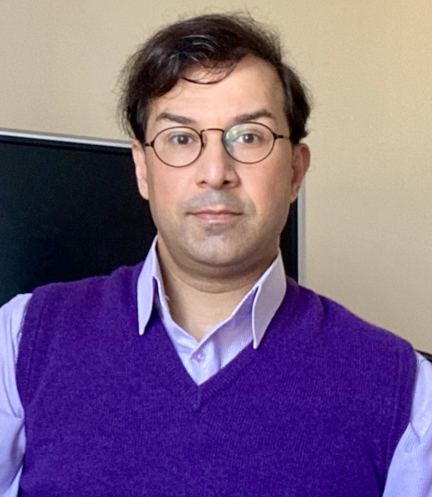

## Academic Staff  

<a href="http://www.cs.ucl.ac.uk/staff/N.Courtois/"><strong>Nicolas Courtois</strong></a>
Senior Lecturer

<a href="http://www0.cs.ucl.ac.uk/staff/G.Danezis/"><strong>George Danezis</strong></a> 
Professor of Security and Privacy Engineering

<a href="https://emilianodc.com/"><strong>Emiliano De Cristofaro</strong></a> 
Professor of Security and Privacy Enhancing Technologies 
<em>Head of Group</em>

<a href="https://philipp.jovanovic.io/"><strong>Philipp Jovanovic</strong></a> 
Associate Professor in Information Security

<a href="https://smeiklej.com/"><strong>Sarah Meiklejohn</strong></a> 
Professor of Cryptography and Security

<a href="https://murdoch.is/"><strong>Steven Murdoch</strong></a> 
Professor of Security Engineering

<a href="http://www0.cs.ucl.ac.uk/staff/D.Pym/"><strong>David Pym</strong></a> 
Professor of Information, Logic, and Security

<a href="https://uclisec.github.io/people/m_angela_sasse/"><strong>Angela M. Sasse</strong></a> 
Professor of Human-Centred Technology

<a href="https://mvasek.com/"><strong>Marie Vasek</strong></a> 
Lecturer

## Research Staff

<a href="http://www.AydinAbadi.com"><strong>Aydin Abadi</strong></a> 
Research Fellow 

<a href="https://www.tristancaulfield.com/"><strong>Tristan Caulfield</strong></a> 
Senior Research Fellow

## Support Staff
- [Silpa Shah](mailto:silpa.shah@ucl.ac.uk) \| Centre Administrator
- [Samantha Bottomley](mailto:s.bottomley@ucl.ac.uk) \| MSc Information Security Administrator 

## Doctoral Researchers

- [Sarah Azouvi](http://www0.cs.ucl.ac.uk/staff/S.Azouvi/)
- Adrián Bermúdez Villalva
- Daniel Blackwell
- Sergi Bray
- Gerard Buckley
- Thomas Cattermole
- Ahana Datta
- [Killian Davitt](https://killiandavitt.me)
- Kyriacos Demetriou
- Albesa Demjaha
- [Alexandros Efstratiou](https://alefstrat.github.io/)
- Stefanos Evripi
- [Georgi Ganev](https://ganevgv.github.io/)
- [Jamie Hayes](http://www.homepages.ucl.ac.uk/~ucabaye/)
- Niamh Healy
- [Alexander Hicks](https://alexanderlhicks.com/)
- Hawra Hosseini-Milani
- [Colin Ife](https://www.colinife.com/)
- Marius Ilau
- [Marios Isaakidis](http://www0.cs.ucl.ac.uk/staff/M.Isaakidis)
- George Kappos
- Emmanouil Koulas
- [Vasilios Mavroudis](https://mavroud.is/)
- Chizzy Meka
- Reza Moqadasi
- [Mohammad Naseri](https://mohammadnaseri.github.io/)
- [Bristena Oprisanu](https://www.bristenaop.com/)
- Kart Padur
- [Antonis Papasavva](https://antonispapasavva.github.io/)
- Ilaria Pia Del Torre
- Dan Ristea
- [Maria Santos](https://mariascrs.github.io/)
- [Maria Schett](http://www.maria-a-schett.net/)
- Henry Skeoch
- Arianna Trozze
- [Antoine Vendeville](https://antoinevendeville.github.io/)
- Matthew Wixley
- [Haaroon Yousaf](http://www.haaroonyousaf.com/)

### Honorary and Visiting Members
- [Jens Groth](http://www.cs.ucl.ac.uk/staff/J.Groth/)
- [Gus Hosein](https://privacyinternational.org/people/95/gus-hosein)
- [Susan Landau](https://privacyink.org/)
- [Ben Laurie](https://en.wikipedia.org/wiki/Ben_Laurie)
- [Simon Parkin](https://uclisec.github.io/people/simon_parkin/)
- [Gianluca Stringhini](https://seclab.bu.edu/people/gianluca/)

