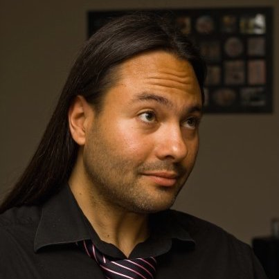
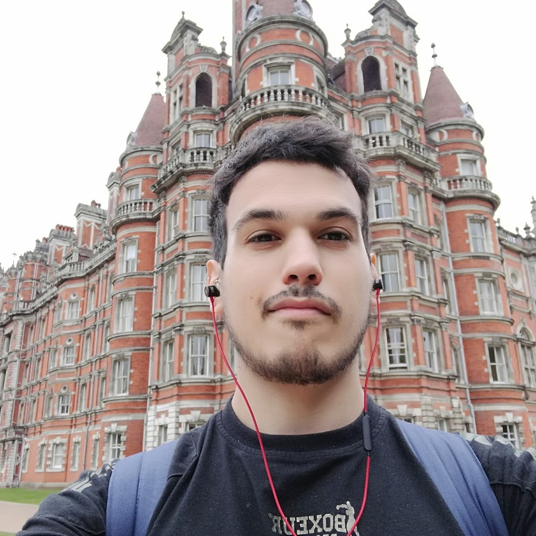
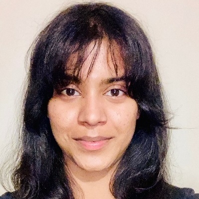
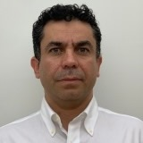
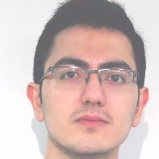

    <button id="all-button" class="filter-button active" onclick="filterTeam('all')">All</button>
    <button id="academic-button" class="filter-button" onclick="filterTeam('academic')">Academics</button>
    <button id="researcher-button" class="filter-button" onclick="filterTeam('researcher')">Researchers</button>
    <button id="administrative-button" class="filter-button" onclick="filterTeam('administrative')">Administrative</button>
    <button id="doctoral-button" class="filter-button" onclick="filterTeam('doctoral')">Doctoral Researchers</button>
    <button id="honorary-button" class="filter-button" onclick="filterTeam('honorary')">Honorary and visiting</button>
    <button id="alumni-button" class="filter-button" onclick="filterTeam('alumni')">Alumni</button>

    

        
        
<strong>Mohamed Abouhashem</strong> 
            Doctoral Researcher (Visitor)
        

    
 
    

        
        
<strong>Valeria Minero Abreu</strong> 
        Senior Research Fellow

    

    

        
        
<strong>Sharad Agarwal</strong> 
            Doctoral Researcher
        

    
 
    

        
        
<strong>Kyle Beadle</strong> 
            Doctoral Resarcher
        

    
 
    

        
        
<strong>Daniel Blackwell</strong> 
            Doctoral Researcher
        

    
 
    

        
        
<strong>Filippo Blancato</strong> 
             Doctoral Researcher
        

    
 
    

        
        
<strong>Samantha Bottomley</strong> 
        MSc Information Security Administrator

    

    

        
        
<strong>Sergi Bray</strong> 
             Doctoral Researcher
        

    
 
    

         
        
<strong>Madeline Carr</strong> 
        Professor of Global Politics and Cyber Security

    

    

        
        
<strong>Tristan Caulfield</strong> 
        Associate Professor of Information Security

    

    

        
        
<strong>Thomas Cattermole</strong> 
             Doctoral Researcher
        

    
 
    

        
        
<strong>Lorenzo Cavallaro</strong> 
        Professor of Computer Science 

    

    

        
        
<strong>Jacopo Cortellazzi</strong> 
             Doctoral Researcher (Visiting)
        

    
 
    

        
        
<strong>George Danezis</strong> 
        Professor of Security and Privacy Engineering (PT) and Chief Scientist at Mysten Labs

    
 
    

        
        
<strong>Ahana Datta</strong> 
             Doctoral Researcher
        

    
 
    

        
        
<strong>Kyriacos Demetriou</strong> 
             Doctoral Researcher
        

    
 
    

        
        
<strong>Giulio De Pasquale</strong> 
             Doctoral Researcher (Visiting)
        

    
 
    

        
        
<strong>Jennifer Dwyer-Joyce</strong> 
             Doctoral Researcher
        

    
 
    

        
        
<strong>Aliai Eusebi</strong> 
             Doctoral Researcher
        

    
 
    

        
        
<strong>Georgi Ganev</strong> 
             Doctoral Researcher
        

    
 
    

        
        
<strong>Arthur Gervais</strong> 
        Professor of Information Security

    

    

        
        
<strong>Jason Gray</strong> 
             Doctoral Researcher (Visiting)
        

    
 
    

        
        
<strong>Isabelle Gressel</strong> 
        UCL InfoSec Gender & Tech Lab Research Administrator

    

    

        
        
<strong>Jens Groth</strong> 
        Honorary

    

    

        
        
<strong>Andreas Gutmann</strong> 
             Honorary Lecturer
        

    
 
    

        
        
<strong>Majid Hatamian</strong> 
             Honorary Senior Researcher Fellow
        

    
 
    

        
        
<strong>Niamh Healy</strong> 
             Doctoral Researcher
        

    
 
    

        
        
<strong>Hawra Hosseini-Milani</strong> 
             Doctoral Researcher
        

    
 
    

        
        
<strong>Marius Ilau</strong> 
             Doctoral Researcher
        

    
 
    

        
        
<strong>Marios Isaakidis</strong> 
             Doctoral Researcher
        

    
 
    

        
        
<strong>Madeleine Janickyj</strong> 
        Research Fellow

    

    

        
        
<strong>Philipp Jovanovic</strong> 
        Professor of Information Security and MSc Information Securty Programme Director

    

    

        
        
<strong>Zeliang "Mark" Kan</strong> 
             Doctoral Researcher (Visiting)
        

    
 
    

        
        
<strong>George Kappos</strong> 
             Doctoral Researcher
        

    
 
    

        
        
<strong>Alireza Kavousi</strong> 
             Doctoral Researcher
        

    
 
    

        
        
<strong>Emmanouil Koulas</strong> 
             Doctoral Researcher
        

    
 
    

        
        
<strong>Nikolaos Koukopoulos</strong> 
        Research Fellow

    

    

        
        
<strong>Susan Landau</strong> 
        Honorary

    

    

        
        
<strong>Ben Laurie</strong> 
            Honorary
        

    

    

        
        
<strong>Sarah Meiklejohn</strong> 
        Professor of Cryptography and Security (PT) and Staff Research Scientist at Google UK

    

    

        
        
<strong>Chizzy Meka</strong> 
             Doctoral Researcher
        

    
 
    

        
        
<strong>Lisa Mekioussa Malki</strong> 
             Doctoral Researcher
        

    
 
    

        
        
<strong>Nadine Michaelides</strong> 
             Doctoral Researcher
        

    
 
    

        
        
<strong>Reza Moqadasi</strong> 
             Doctoral Researcher
        

    
 
    

        
        
<strong>Steven Murdoch</strong> 
        Professor of Security Engineering, Head of Group, and Royal Society University Research Fellow

    

    

        
        
<strong>Mohammad Naseri</strong> 
             Doctoral Researcher
        

    
 
    

        
        
<strong>Catherine O'Brien</strong> 
        Research Fellow

    

    

        
        
<strong>Marilyne Ordekian</strong> 
             Doctoral Researcher
        

    
 
    

        
        
<strong>Kärt Padur</strong> 
             Doctoral Researcher
        

    
 
    

        
        
<strong>Simon Parkin</strong> 
            Honorary
        

    

    

        
        
<strong>Feargus Pendlebury</strong> 
             Doctoral Researcher (Visiting)
        

    
 
    

        
        
<strong>Ilaria Pia Del Torre</strong> 
             Doctoral Researcher
        

    
 
    

        
        
<strong>Fabio Pierazzi</strong> 
             Associate Professor 
        

    
 
    

        
        
<strong>David Pym</strong> 
        Professor of Information, Logic, and Security

    

    

        
        
<strong>Demelza Luna Reaver</strong> 
             Doctoral Researcher
        

    
 
    

        
        
<strong>Dan Ristea</strong> 
             Doctoral Researcher
        

    
 
    

        
        
<strong>Nuur Alifah Roslan (Alifah)</strong> 
        Visiting Research Fellow

    

    

        
        
<strong>M. Angela Sasse</strong> 
        Professor of Human-Centred Technology (PT), and Professor at Ruhr-University Bochum

    

    

        
        
<strong>Maria Schett</strong> 
             Doctoral Researcher
        

    
 
    

        
        
<strong>Silpa Shah</strong> 
        UCL InfoSec Centre Administrator

    

    

        
        
<strong>Karolina Skrivankova</strong> 
             Doctoral Researcher
        

    
 
    

        
        
<strong>Gianluca Stringhini</strong> 
            Honorary
        

    

    

        
        
<strong>Leonie Tanczer</strong> 
        Associate Professor and UKRI Future Leaders Fellow

    

    

        
        
<strong>Guy Thompson</strong> 
             Doctoral Researcher
        

    
 
    

        
        
<strong>Arianna Trozze</strong> 
             Doctoral Researcher
        

    
 
    

        
        
<strong>Marie Vasek</strong> 
        Lecturer of Information Security

    

    

        
        
<strong>Antoine Vendeville</strong> 
             Doctoral Researcher
        

    
 
    

        
        
<strong>Mark Warner</strong> 
        Lecturer of Information Security

    

    

        
        
<strong>Charles Westphal</strong> 
             Doctoral Researcher
        

    
 
    

        
        
<strong>Matthew Wixley</strong> 
             Doctoral Researcher
        

    
 

<h2>Alumni</h2>

    

        
        
<strong>Killian Davitt</strong> 
             Doctoral Researcher
        

    
 
    

        
        
<strong>Alexander Hicks</strong> 
             Doctoral Researcher
        

    
 
    

        
        
<strong>Haaroon Yousaf</strong> 
             Doctoral Researcher
        

    
 
    

        
        
<strong></strong> 
        

    

    

        
        
<strong>Henry Skeoch</strong> 
             Doctoral Researcher
        

    
 
    

        
        
<strong>Lauren Scott</strong> 
             Doctoral Researcher (Visiting)
        

    
 
        

        
        
<strong>Maria Santos</strong> 
             Doctoral Researcher
        

    
 
        

        
        
<strong>Lilly Neubauer</strong> 
             Doctoral Researcher
        

    
 
        

        
        
<strong>Stefanos Evripi</strong> 
             Doctoral Researcher
        

    
 
        

        
        
<strong>Antonis Papasavva</strong> 
             Doctoral Researcher
        

    
 
        

        
        
<strong>Alexandros Efstratiou</strong> 
             Doctoral Researcher
        

    
 
     

        
        
<strong>Gerard Buckley</strong> 
             Doctoral Researcher
        

    
 

