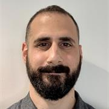

## Academic Staff  

<a href="https://www.ucl.ac.uk/computer-science/people/professor-madeline-carr"><strong>Madeline Carr</strong></a> 
Professor of Global Politics and Cyber Security

<a href="https://www.tristancaulfield.com/"><strong>Tristan Caulfield</strong></a> 
Associate Professor 
<em>Director of the Research Institute in Sociotechnical Cyber Security (<a href="https://www.riscs.org.uk">RISCS</a>)</em>

<a href="https://scholar.google.com/citations?user=oWT7fIYAAAAJ&hl=en"><strong>Lorenzo Cavallaro</strong></a> 
Professor of Computer Science 
<em>Leader of the <a href="https://s2lab.cs.ucl.ac.uk">Systems Security Research Lab</a></em>

<a href="http://www0.cs.ucl.ac.uk/staff/G.Danezis/"><strong>George Danezis</strong></a> 
Professor of Security and Privacy Engineering 
<em>Part-time, also Chief Scientist at Mysten Labs</em>

<!---

<a href="https://emilianodc.com/"><strong>Emiliano De Cristofaro</strong></a> 
Professor of Security and Privacy Enhancing Technologies 
<em>Director of the Academic Centre of Excellence in Cyber Security Research (<a href="https://www.ucl.ac.uk/cybersecurity-centre-of-excellence/">ACE-CSR</a>) </em>
 --->

<a href="https://philipp.jovanovic.io/"><strong>Philipp Jovanovic</strong></a> 
Associate Professor in Information Security 
<em>MSc Information Security Programme Director</em>

<a href="https://smeiklej.com/"><strong>Sarah Meiklejohn</strong></a> 
Professor of Cryptography and Security 
<em>Part-time, also Staff Research Scientist at Google UK</em>

<a href="http://www0.cs.ucl.ac.uk/staff/D.Pym/"><strong>David Pym</strong></a> 
Professor of Information, Logic, and Security

<a href="https://murdoch.is/"><strong>Steven Murdoch</strong></a> 
Professor of Security Engineering, <em>Head of Group</em> 
<em>Royal Society University Research Fellow</em>

<a href="https://uclisec.github.io/people/m_angela_sasse/"><strong>M. Angela Sasse</strong></a> 
Professor of Human-Centred Technology 
<em>Part-time, also Professor at Ruhr-University Bochum</em>

<a href="https://www.leonietanczer.net/"><strong>Leonie Tanczer</strong></a> 
Associate Professor 
<em>UKRI Future Leaders Fellow</em>

<a href="https://mvasek.com/"><strong>Marie Vasek</strong></a> 
Lecturer
  

<a href="https://www.privacurity.com/"><strong>Mark Warner</strong></a> 
Lecturer

<a href="https://arthurgervais.com/"><strong>Arthur Gervais</strong></a> 
Associate Professor

## Research Staff

<a href="http://www.AydinAbadi.com"><strong>Aydin Abadi</strong></a> 
Senior Research Fellow

<a href="https://www.linkedin.com/in/jose-tomas-llanos-20665935/"><strong>Jose Tomas Llanos</strong></a> 
Research Fellow

  
<a href="https://iris.ucl.ac.uk/iris/browse/profile?upi=MJANI49"><strong>Madeleine Janickyj</strong></a> 
Research Fellow

  
<a href="https://iris.ucl.ac.uk/iris/browse/profile?upi= NKOUK63"><strong> Nikolaos Koukopoulos</strong></a> 
Research Fellow

## Centre Administrators
- [Samantha Bottomley](mailto:s.bottomley@ucl.ac.uk) \| MSc Information Security Administrator 
- [Silpa Shah](mailto:silpa.shah@ucl.ac.uk) \| UCL InfoSec Centre Administrator

## Doctoral Researchers

- [Mohamed Abouhashem](https://s2lab.cs.ucl.ac.uk), Visitor
- [Sharad Agarwal](https://sharad1126.github.io/)
- Daniel Blackwell
- Filippo Blancato
- Sergi Bray
- Gerard Buckley
- Thomas Cattermole
- [Jacopo Cortellazzi](https://s2lab.cs.ucl.ac.uk), Visitor
- Ahana Datta
- [Killian Davitt](https://killiandavitt.me)
- Kyriacos Demetriou
- [Giulio De Pasquale](https://s2lab.cs.ucl.ac.uk), Visitor
- Jennifer Dwyer-Joyce
- [Alexandros Efstratiou](https://alefstrat.github.io/)
- Aliai Eusebi
- Stefanos Evripi
- [Georgi Ganev](https://ganevgv.github.io/)
- [Jason Gray](https://s2lab.cs.ucl.ac.uk), Visitor
- Niamh Healy
- [Alexander Hicks](https://alexanderlhicks.com/)
- Hawra Hosseini-Milani
- Marius Ilau
- [Marios Isaakidis](http://www0.cs.ucl.ac.uk/staff/M.Isaakidis)
- [Zeliang "Mark" Kan](https://s2lab.cs.ucl.ac.uk), Visitor
- George Kappos
- Alireza Kavousi
- Emmanouil Koulas
- [Demelza Luna Reaver](https://twitter.com/demelza_r)
- Chizzy Meka
- Nadine Michaelides
- Reza Moqadasi
- [Mohammad Naseri](https://mohammadnaseri.github.io/)
- Lilly Neubauer
- Marylyne Ordekian
- Kärt Padur
- [Antonis Papasavva](https://antonispapasavva.github.io/)
- [Feargus Pendlebury](https://s2lab.cs.ucl.ac.uk), Visitor
- Ilaria Pia Del Torre
- [Dan Ristea](https://dri.st)
- [Maria Santos](https://mariascrs.github.io/)
- [Maria Schett](http://www.maria-a-schett.net/)
- [Lauren Scott](https://laurenscott.dev/), Visitor
- Henry Skeoch
- Karolina Skrivankova
- Guy Thompson
- Arianna Trozze
- [Antoine Vendeville](https://antoinevendeville.github.io/)
- Charles Westphal
- Matthew Wixley
- [Haaroon Yousaf](http://www.haaroonyousaf.com/)

### Honorary and Visiting Members
- [Jens Groth](http://www.cs.ucl.ac.uk/staff/J.Groth/)
- [Gus Hosein](https://privacyinternational.org/people/95/gus-hosein)
- [Susan Landau](https://privacyink.org/)
- [Ben Laurie](https://en.wikipedia.org/wiki/Ben_Laurie)
- [Simon Parkin](https://uclisec.github.io/people/simon_parkin/)
- [Gianluca Stringhini](https://seclab.bu.edu/people/gianluca/)

