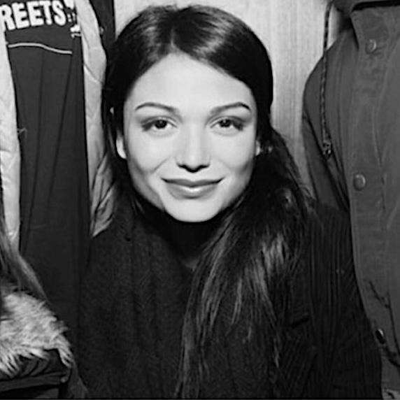

    <button id="all-button" class="filter-button active" onclick="filterTeam('all')">All</button>
    <button id="academic-button" class="filter-button" onclick="filterTeam('academic')">Academics</button>
    <button id="researcher-button" class="filter-button" onclick="filterTeam('researcher')">Researchers</button>
    <button id="administrative-button" class="filter-button" onclick="filterTeam('administrative')">Administrative</button>
    <button id="doctoral-button" class="filter-button" onclick="filterTeam('doctoral')">Doctoral Researchers</button>
    <button id="honorary-button" class="filter-button" onclick="filterTeam('honorary')">Honorary and visiting</button>
    <button id="alumni-button" class="filter-button" onclick="filterTeam('alumni')">Alumni</button>

<h2>Academic</h2>

    

         
        
<strong>Madeline Carr</strong> 
        Professor of Global Politics and Cyber Security

    

    

        
        
<strong>Tristan Caulfield</strong> 
        Associate Professor of Information Security

    

    

        
        
<strong>Lorenzo Cavallaro</strong> 
        Professor of Systems Security

    

    

        
        
<strong>George Danezis</strong> 
        Professor of Security and Privacy Engineering (PT) and Chief Scientist at Mysten Labs

    

    

        
        
<strong>Arthur Gervais</strong> 
        Associate Professor of Information Security

    

    

        
        
<strong>Philipp Jovanovic</strong> 
        Associate Professor of Information Security and MSc Information Securty Programme Director

    

    

        
        
<strong>Sarah Meiklejohn</strong> 
        Professor of Cryptography and Security (PT) and Staff Research Scientist at Google UK

    

    

        
        
<strong>David Pym</strong> 
        Professor of Information, Logic, and Security

    

    

        
        
<strong>Steven Murdoch</strong> 
        Professor of Security Engineering, Head of Group, and Royal Society University Research Fellow

    

    

        
        
<strong>M. Angela Sasse</strong> 
        Professor of Human-Centred Technology (PT), and Professor at Ruhr-University Bochum

    

    

        
        
<strong>Leonie Tanczer</strong> 
        Associate Professor and UKRI Future Leaders Fellow

    

    

        
        
<strong>Marie Vasek</strong> 
        Lecturer of Information Security

    

    

        
        
<strong>Mark Warner</strong> 
        Lecturer of Information Security

    

    

        
        
<strong></strong> 
        

    

    

        
        
<strong></strong> 
        

    
 
    

        
        
<strong></strong> 
        

    
 

<h2>Researchers</h2>

    

        
        
<strong>Valeria Minero Abreu</strong> 
        Senior Research Fellow

    

    

        
        
<strong>Madeleine Janickyj</strong> 
        Research Fellow

    

    

        
        
<strong>Nikolaos Koukopoulos</strong> 
        Research Fellow

    

    

        
        
<strong>Catherine O'Brien</strong> 
        Research Fellow

    

<h2>Administrative Staff</h2>

    

        
        
<strong>Samantha Bottomley</strong> 
        MSc Information Security Administrator

    

    

        
        
<strong>Silpa Shah</strong> 
        UCL InfoSec Centre Administrator

    

    

        
        
<strong>Isabelle Gressel</strong> 
        UCL InfoSec Gender & Tech Lab Research Administrator

    

    

        
        
<strong></strong> 
        

    

## Doctoral Researchers

- [Mohamed Abouhashem](https://s2lab.cs.ucl.ac.uk), Visitor
- [Sharad Agarwal](https://sharad1126.github.io/)
- Daniel Blackwell
- Filippo Blancato
- Sergi Bray
- Gerard Buckley
- Thomas Cattermole
- [Jacopo Cortellazzi](https://s2lab.cs.ucl.ac.uk), Visitor
- Ahana Datta
- [Killian Davitt](https://killiandavitt.me)
- Kyriacos Demetriou
- [Giulio De Pasquale](https://s2lab.cs.ucl.ac.uk), Visitor
- Jennifer Dwyer-Joyce
- [Alexandros Efstratiou](https://alefstrat.github.io/)
- Aliai Eusebi
- Stefanos Evripi
- [Georgi Ganev](https://ganevgv.github.io/)
- [Jason Gray](https://s2lab.cs.ucl.ac.uk), Visitor
- Niamh Healy
- Hawra Hosseini-Milani
- Marius Ilau
- [Marios Isaakidis](http://www0.cs.ucl.ac.uk/staff/M.Isaakidis)
- [Zeliang "Mark" Kan](https://s2lab.cs.ucl.ac.uk), Visitor
- George Kappos
- Alireza Kavousi
- Emmanouil Koulas
- [Demelza Luna Reaver](https://twitter.com/demelza_r)
- Chizzy Meka
- Nadine Michaelides
- Reza Moqadasi
- [Mohammad Naseri](https://mohammadnaseri.github.io/)
- Lilly Neubauer
- Marilyne Ordekian
- Kärt Padur
- [Antonis Papasavva](https://antonispapasavva.github.io/)
- [Feargus Pendlebury](https://s2lab.cs.ucl.ac.uk), Visitor
- Ilaria Pia Del Torre
- [Dan Ristea](https://dri.st)
- [Maria Santos](https://mariascrs.github.io/)
- [Maria Schett](http://www.maria-a-schett.net/)
- [Lauren Scott](https://laurenscott.dev/), Visitor
- Henry Skeoch
- Karolina Skrivankova
- Guy Thompson
- Arianna Trozze
- [Antoine Vendeville](https://antoinevendeville.github.io/)
- Charles Westphal
- Matthew Wixley
- [Alexander Hicks](https://alexanderlhicks.com/)
- [Haaroon Yousaf](http://www.haaroonyousaf.com/)

### Honorary and Visiting Members
- [Jens Groth](http://www.cs.ucl.ac.uk/staff/J.Groth/)
- [Gus Hosein](https://privacyinternational.org/people/95/gus-hosein)
- [Susan Landau](https://privacyink.org/)
- [Ben Laurie](https://en.wikipedia.org/wiki/Ben_Laurie)
- [Simon Parkin](https://uclisec.github.io/people/simon_parkin/)
- [Gianluca Stringhini](https://seclab.bu.edu/people/gianluca/)

